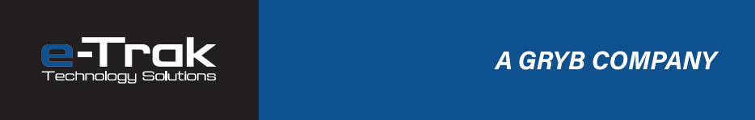

  

---

  <a href="https://github.com/ETrakSolutions/PortailProjets" target="_blank">
    <strong>🔒 Accéder au Portail des Projets</strong>
  </a> 
  <em>Dépôt privé – index central de tous les projets</em>

---

## 🚧 À propos de nous  
**E-Trak Solutions** développe des technologies embarquées avancées destinées à améliorer la sécurité, la productivité et la précision dans le domaine de la **machinerie lourde**.

Nous combinons :
- l’électronique industrielle  
- les capteurs intelligents  
- l’automatisation  
- l’analyse de données  
- l’intégration mobile (Android / IoT)  

pour créer des systèmes robustes, fiables et adaptés aux environnements exigeants.

---

## 🏗️ Domaines d’expertise
### 🔹 Sécurité et prévention
- Limiteurs de portée pour grues et équipements mobiles  
- Systèmes d’alerte et de prévention des collisions  
- Zones interdites / géorepérage intelligent  
- Analyse de proximité (capteurs, vision, IA)

### 🔹 Contrôle & automatisation embarquée
- Modules électroniques personnalisés  
- Contrôleurs haute performance (MCU, IoT industriel)  
- Acquisition de données en temps réel  
- Télédiagnostics & télémétrie

### 🔹 Intégration logicielle
- Applications HMI 
- Serveurs embarqués (HTTP, WebSocket)  
- Interfaces Web industrielles  
- Systèmes de mise à jour OTA

---

## 🚜 Secteurs d'activité
- Machinerie lourde  
- Construction  
- Grues mobiles & équipements élévateurs  
- Agriculture  
- Véhicules spécialisés  

---

## 🎯 Vision
Créer des solutions intelligentes, robustes et accessibles, conçues pour réduire les risques, augmenter la précision et moderniser les équipements de chantier.

---

## 🌐 Site officiel
**➡ https://www.e-trak.ca/**

---

## 📬 Contact
Pour toute demande professionnelle :  
📧 **info@e-trak.ca**

---

  © 2025 E-Trak Solutions — Technologie intelligente pour la machinerie lourde

